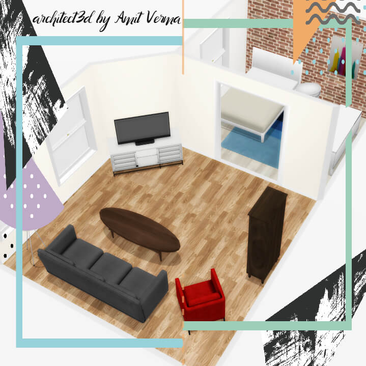

WebGL based 3D interior designing tool with 2D Floor Planer
## About
This is a customizable application built on three.js that allows users to design an interior space such as a home or apartment.

[Live Demo](http://amitukind.com/projects/architect3d/)



 Below are screenshots from  [Live Demo](http://amitukind.com/projects/architect3d/)

1) Create 2D floorplan:


2) Add items:


3) Design in 3D:


## Developing and Running Locally

To get started, clone the repository and ensure you npm >= 3 and rollup installed, then run:

    npm install
    rollup -c

Rollup will only run if you have enabled command execution . If not run the following command first :
```bash
//Windows 10
Get-ExecutionPolicy -List
Set-ExecutionPolicy -ExecutionPolicy RemoteSigned -Scope CurrentUser
```
The latter command generates `build/js/bp3djs.js` from `src`. 

```
NODE_ENV=production rollup -c
```

The above command will generate `build/js/bp3djs.min.js` a minified and uglified version of the js. The easiest way to run locally is by

```
     rollup -c -w
```
Then, visit `http://localhost:10001` in your browser.


## Directory Structure

### `src/` Directory

The `src` directory contains the core of the project. Here is a description of the various sub-directories:

`core` - Basic utilities such as logging and generic functions

`floorplanner` - 2D view/controller for editing the floorplan

`items` - Various types of items that can go in rooms

`model` - Data model representing both the 2D floorplan and all of the items in it

`three` - 3D view/controller for viewing and modifying item placement


## DOCS ##
Included


## Author
[@amitukind](https://github.com/amitukind/) | [Website](http://amitukind.com/) | [amitverma.ukind@gmail.com](mailto:amitverma.ukind@gmail.com)
