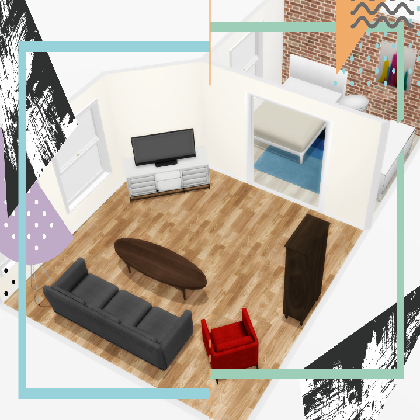
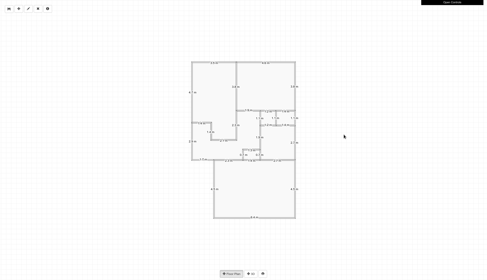
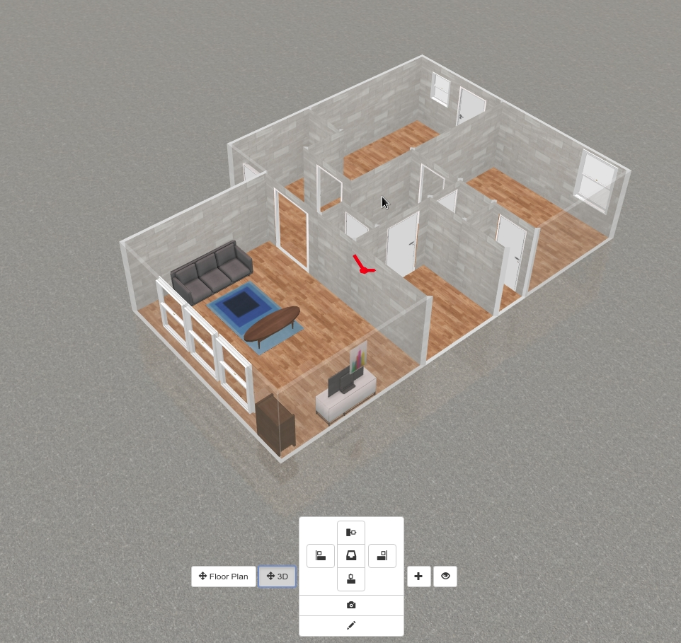

# architect3d

WebGL 3D interior design tool with a 2D floorplanner.

Draw walls by clicking, close a loop to make a room, furnish it from a catalog
of 168 models, change wall and floor textures, dimension and label the plan, and
walk through the result in first person. Plan and 3D view side by side — the furniture is drawn on both,
and selecting anything in one view selects it in the other — with undo on
everything, and a dark or light theme that reaches the drawing canvas as well as
the chrome.

**[Documentation](https://amitukind.github.io/architect3d/docs/)** ·
**[Live app](https://amitukind.github.io/architect3d/)**



1) Create a 2D floorplan:



2) Add items:


3) Design in 3D:




## Running it

```bash
git clone https://github.com/amitukind/architect3d.git
cd architect3d
npm install
npm run dev
```

Then visit `http://localhost:10001`. Node 22+ and a WebGL2 browser.

There is no asset step and no generator to run first — the models and textures
are checked in under `public/`, which Vite serves at the site root.

| Command | What it does |
|---|---|
| `npm run dev` | Dev server on port 10001, with hot reload |
| `npm run build` | Library build &rarr; `dist/`: the ESM entry, the `BP3DJS` IIFE, and the declarations |
| `npm run build:demo` | Application build &rarr; `dist-demo/` |
| `npm test` | The vitest suite (1,647 tests, headless) |
| `npm run test:coverage` | The same suite, with coverage and its thresholds |
| `npm run test:browser` | The browser tier: real canvas, real WebGL, axe (needs chromium) |
| `npm run lint` | ESLint |
| `npm run typecheck` | Type-check the JSDoc and the SFC templates (`vue-tsc`) |
| `npm run budget` | Check the built output against `tools/budget.json` |
| `npm run docs` | The documentation site, with hot reload |
| `npm run docs:build` | The documentation site &rarr; `docs/.vitepress/dist` |
| `npm run fixtures` | Regenerate `tests/fixtures/*.blueprint3d` |
| `npm run parity` | Render eleven states through three r98 and r185 side by side |

Nothing deploys automatically. The Deploy workflow is `workflow_dispatch` only —
GitHub Pages was never enabled for this repository, so a push-triggered deploy
failed on every push to `master` and trained everyone to ignore a red mark. The
build, the budgets and the artifact upload are all still in it, ready for
whenever there is a target; the plan is Cloudflare.

### Checks

`npm install` also installs a **pre-commit hook** — it lints the files you
staged and runs the test suites that import them. That is deliberate rather than
incidental: CI runs on `dev` and `master` only, to conserve Actions minutes, so
without a local hook nothing at all runs before a merge. It costs nothing and
takes a couple of seconds.

`git commit --no-verify` skips a single commit, and `SKIP_SIMPLE_GIT_HOOKS=1`
skips the hook wherever it is set. To avoid *installing* it at all — which is
what CI does — set `SKIP_INSTALL_SIMPLE_GIT_HOOKS=1` before `npm ci`.

CI then runs two jobs in parallel. The first is the type check, the suite with
coverage thresholds, ESLint, all three builds and the size budgets. The second
is the browser tier — `npm run test:browser`, which needs chromium
(`npx playwright install chromium`) and is the only thing here that checks the
renderers produce anything: the plan is rasterised into a real canvas and its
pixels read back, the 3D view is composited through a real WebGL2 context, and
axe-core runs over the booted application. The coverage floor, the budget limits and
the set of type-checked files are all committed and all ratchets — extend them
when a change earns it, and never relax one to make a build pass. The full gate
ladder, including the browser-based tier that is not built yet, is
[RM-002 §13](./docs/public/roadmap.html).

### Types

There are no `.ts` files and there is not meant to be one. The library is ESM
with thorough JSDoc, and `npm run typecheck` makes that JSDoc mean something —
`vue-tsc` checks the annotations *and* the SFC templates against their script
blocks.

Checking is **opt-in per file**: a file joins by putting `// @ts-check` on its
first line, or on the first line inside `<script setup>`. Every file is in, all
113 of them, with zero errors — the library tier went from 355 errors to none in
RM-005 C2, so `npm run typecheck` rather than an audit somebody remembers to run
is what fails on a regression. The ledger of what is in, and what each
remaining area would cost, is at the top of
[`tsconfig.json`](./tsconfig.json).


## Using it

| | |
|---|---|
| **Workspace** | <kbd>1</kbd> plan · <kbd>2</kbd> split · <kbd>3</kbd> 3D. In split, drag the divider between the panes. |
| **Drawing** | <kbd>V</kbd> select · <kbd>W</kbd> draw walls · <kbd>R</kbd> rectangular room · <kbd>X</kbd> delete · <kbd>S</kbd> snap to grid. Hold <kbd>Shift</kbd> while drawing for the grid too. While drawing, type an exact length and angle in the bar at the top. |
| **Annotating** | <kbd>D</kbd> dimension between two points · <kbd>T</kbd> text label. A room's name, type and ceiling height are in the panel; north is under Settings &rarr; Plan. |
| **Exporting** | The share menu writes the plan as SVG at 1:20, 1:50, 1:100 or 1:200, as a 2400&nbsp;px PNG, or straight to the printer &mdash; each sheet with a scale bar, a title block and the north arrow. |
| **Zoom** | Wheel over the plan, or <kbd>+</kbd> / <kbd>-</kbd>. <kbd>Shift</kbd><kbd>F</kbd> frames the whole plan. |
| **Furniture** | <kbd>A</kbd> opens the catalog. It stays open while you pick, and searches all 168 models. |
| **Editing** | <kbd>⌘Z</kbd> / <kbd>⌘⇧Z</kbd> undo and redo · <kbd>⌘D</kbd> duplicate · <kbd>Del</kbd> delete. |
| **3D** | <kbd>F</kbd> walk through · <kbd>O</kbd> orthographic · <kbd>G</kbd> wireframe. |

<kbd>⇧</kbd><kbd>?</kbd> shows the full list, built from the same binding table
the shortcuts are, so it cannot go stale.

Work in progress is kept in the browser's local storage and offered back after
a reload — as an offer, not an automatic restore, so closing a design to start
fresh does not silently bring it back.

### Studio and Classic

The 3D view has two render profiles, switched bottom-right of the viewport.
**Studio** is the default: lit walls, an image-based environment, filmic tone
mapping and fog to the horizon. **Classic** is exactly what the app looked like
through 1.0.0 — unlit walls, Phong floors, no tone mapping. It is kept because
ten sprints of parity work went into it and it is the reference this viewer's
output is checked against. See
[Architecture](https://amitukind.github.io/architect3d/docs/architecture) for
what each one changes.


## Installing it

```bash
npm install architect3d three bezier-js
```

`three` and `bezier-js` are **peer dependencies** — the library uses whichever
copy you already have, so `instanceof` works across the boundary and you are not
shipping two engines. The peer range is `three >= 0.185.0`, the version the suite
runs against; three breaks in minor releases, so anything lower is untested
rather than unsupported.

| Entry | What it is |
|---|---|
| `architect3d` | ESM, ~81 kB gzipped, three and bezier-js external |
| `architect3d/iife` | One self-executing bundle exposing `BP3DJS`, three included — for a plain `<script>` tag |
| `architect3d/source/*` | The unbundled sources, if you would rather build them yourself |

Types are generated from the JSDoc and ship with the package.

## Documentation

| | |
|---|---|
| [Getting started](https://amitukind.github.io/architect3d/docs/getting-started) | Running it, the commands, embedding the library |
| [Architecture](https://amitukind.github.io/architect3d/docs/architecture) | How the layers fit together, and where they meet |
| [Save file format](https://amitukind.github.io/architect3d/docs/save-format) | Every field in a `.blueprint3d` file, and how an older one is read |
| [Events](https://amitukind.github.io/architect3d/docs/events) | What fires, from where, carrying what |
| [Migration roadmap](https://amitukind.github.io/architect3d/docs/roadmap.html) | The ten-sprint plan, and what each sprint delivered |

The sources are Markdown under [`docs/`](./docs); `npm run docs` serves them
locally.


## Layout

```
src/scripts/   the library - plain ESM, no Vue, no CSS
src/app/       the Vue 3 application built on it
src/catalog/   the item palette and the texture list, as JSON
public/        assets the running app loads (models, textures, thumbnails)
asset-pipeline/ inputs and records that are not served: the 25 pre-migration
               three.js JSON models the .glb files were converted from, the
               .blend authoring files, and the conversion report
tests/         1,647 headless tests; see tests/README.md
tools/         one-off and migration tooling (conversion, goldens, parity)
docs/          this documentation site
```

The arrow between the two `src/` halves points one way: `src/app` imports
`src/scripts` and nothing goes back. There is no Vue anywhere in the library,
and `npm run build` bundles the library alone — which is what makes it
embeddable in a page that has never heard of Vue, and what lets the whole test
suite run with no renderer and no browser.

Inside `src/scripts`:

| | |
|---|---|
| `core` | units, configuration, events, geometry helpers |
| `model` | the plain-data floorplan and scene — no DOM, no GPU |
| `floorplanner` | the 2D view and its controller |
| `three` | the 3D view, cameras, controls and exporters |
| `items` | the eight item classes and the factory |

Inside `src/app`:

| | |
|---|---|
| `components` | the shell: top bar, tool rail, status bar, viewports, catalog |
| `composables` | lifetime, selection, camera, layout, history, zoom, theme, file IO |
| `inspector` | the selection panels, texture grid and settings |


## About

Built on [three.js](https://threejs.org/), descended from
[blueprint3d](https://github.com/furnishup/blueprint3d), and rebuilt over ten
sprints from rollup + Babel + jQuery + three r98 onto Vite + Vue 3 + three
0.185.

The runtime dependencies are Vue, three and bezier-js; there are no others. The
interface is built with Tailwind CSS 4, [Reka UI](https://reka-ui.com/), lucide
and VueUse, and all four are **devDependencies** — the published package is
`src/scripts` alone, which imports none of them and ships no CSS.

See [CHANGELOG.md](./CHANGELOG.md) for what changed, and the
[migration roadmap](https://amitukind.github.io/architect3d/docs/roadmap.html)
for why.


## Author

[@amitukind](https://github.com/amitukind/) ·
[Website](http://amitukind.com/) ·
[amitverma.ukind@gmail.com](mailto:amitverma.ukind@gmail.com)

Released under the ISC licence.
